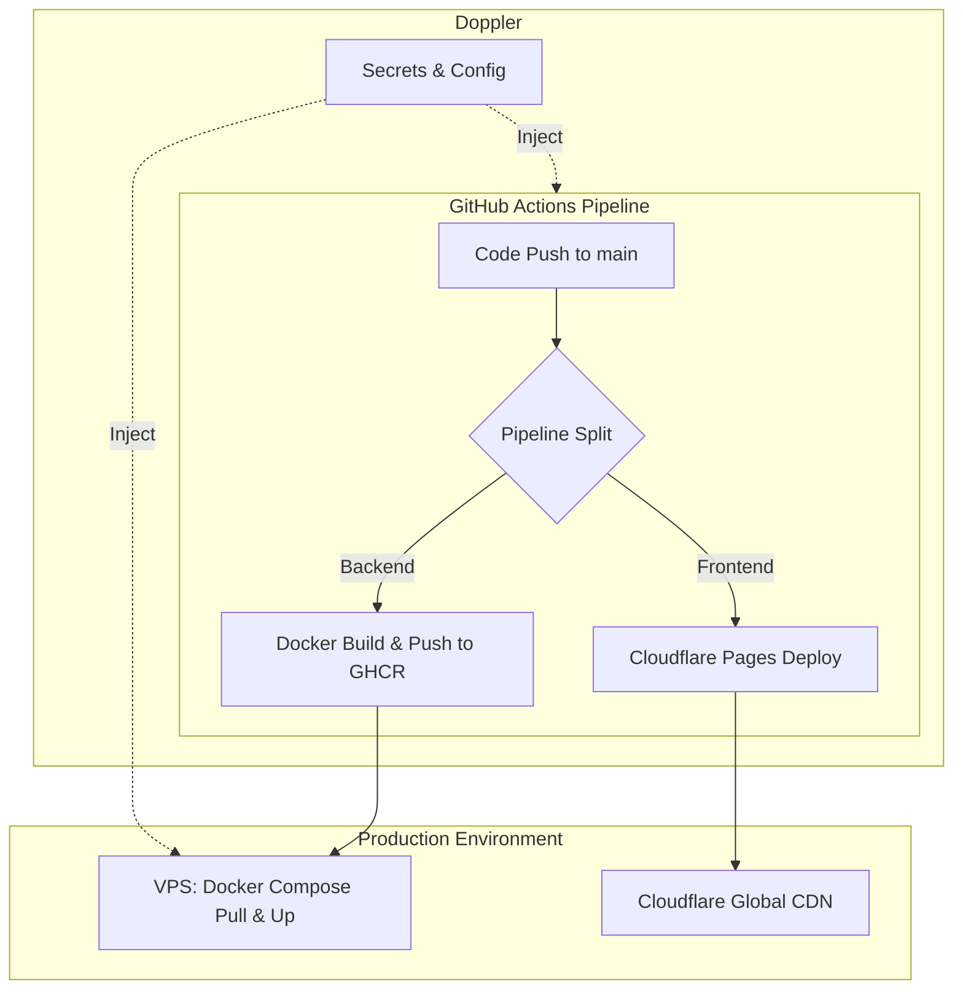

# CI/CD 및 배포 아키텍처 가이드

이 문서는 프로젝트의 지속적 통합(CI) 및 지속적 배포(CD) 파이프라인과 운영 서버의 아키텍처에 대해 설명합니다. 본 프로젝트는 백엔드와 프론트엔드의 배포 파이프라인이 분리된 아키텍처를 채택하고 있습니다.

## 1. CI/CD 아키텍처 개요

본 프로젝트는 서비스의 성능 최적화와 관리 효율성을 위해 백엔드와 프론트엔드의 배포 환경을 분리하였습니다.

- **Backend**: Docker 기반의 컨테이너 환경으로 빌드되어 VPS(Virtual Private Server)에 배포됩니다.
- **Frontend**: Cloudflare Pages를 통해 글로벌 CDN 환경으로 배포됩니다.

### 변경 경로 기반 조건부 배포
본 저장소는 변경 경로를 기준으로 배포 여부를 결정합니다. 백엔드 또는 프론트엔드 변경에 해당하는 경우에만 배포가 실행되며, 그 외 변경은 전부 **Non Deploy**입니다.

- **Frontend 변경 경로**: `static/**`
- **Backend 변경 경로**: `app/**`, `alembic/**`, `tests/**`, `pyproject.toml`, `poetry.lock`, `Dockerfile`, `docker-compose*.yml`, `entrypoint.sh`, `Makefile`, `alembic.ini`, `pyrightconfig.json`, `pytest.ini`
- **동작 규칙(4가지 케이스)**:
  - `backend-only`: 백엔드 Lint/Test/Build/Deploy 실행
  - `frontend-only`: Frontend Deploy 실행
  - `both (frontend + backend)`: 백엔드 파이프라인과 Frontend Deploy를 모두 실행
  - `non-deploy`: 배포 관련 Job 미실행
- **태깅**: backend deploy 또는 frontend deploy 중 하나라도 성공하면 태깅됩니다.

### 배포 분리 이유 (Why Split?)
1. **성능 및 CDN 활용**: 프론트엔드 정적 파일을 Cloudflare의 글로벌 CDN을 통해 서빙함으로써 전 세계 사용자에게 빠른 응답 속도를 제공합니다.
2. **백엔드 부하 감소**: FastAPI 서버가 정적 파일을 직접 서빙하지 않도록 분리하여 API 처리 성능을 향상시켰습니다.
3. **독립적 배포**: 프론트엔드와 백엔드 코드가 동일한 저장소에 있지만, 각각의 변경 사항에 대해 최적화된 배포 전략을 가질 수 있습니다.

---

## 2. 백엔드 배포 파이프라인 (VPS)

### 파이프라인 단계 (Stages)
1. **Lint**: `Ruff`를 사용하여 코드 스타일 및 정적 분석을 수행합니다.
2. **Test**: `Pytest`를 통해 유닛 테스트 및 통합 테스트를 실행합니다.
3. **Build**: Docker 이미지를 빌드하고 GitHub Container Registry (GHCR)에 푸시합니다.
    - 빌드 타겟 플랫폼: **`linux/arm64`**
4. **Deploy**: 운영 서버에 SSH로 접속하여 `docker compose`를 통해 최신 이미지를 반영합니다.

### 배포 구성
- **Application**: Docker Compose 기반 컨테이너 환경
- **Port**: 애플리케이션 포트는 호스트의 **10000**번 포트에 바인딩되어 있습니다.
- **Secrets Management**: [Doppler](https://doppler.com)를 통해 런타임에 환경 변수를 주입합니다.

---

## 3. 프론트엔드 배포 파이프라인 (Cloudflare Pages)

프론트엔드 정적 파일(`static/` 디렉토리)은 GitHub Actions를 통해 Cloudflare Pages로 배포됩니다.

### 파이프라인 단계 (Stages)
1. **Lint**: 백엔드와 공통으로 린트 과정을 거칩니다.
2. **Deploy Frontend**: `cloudflare/pages-action`을 사용하여 `static/` 폴더를 Cloudflare Pages 프로젝트(`tuum-hotdeal`)에 업로드합니다.

### 필요한 시크릿 (Secrets)
Cloudflare 배포를 위해 다음 환경 변수가 필요하며, 이는 Doppler에서 관리됩니다.
- `CLOUDFLARE_PAGES_API_TOKEN`: Cloudflare API 토큰
- `CLOUDFLARE_ACCOUNT_ID`: Cloudflare 계정 ID

---

## 4. 시크릿 관리 (Doppler)

본 프로젝트는 모든 환경 변수와 비밀 키를 [Doppler](https://doppler.com)에서 중앙 집중식으로 관리합니다.

- **백엔드**: 서버 내 `DOPPLER_TOKEN`을 사용하여 컨테이너 실행 시 실시간으로 환경 변수를 주입합니다.
- **프론트엔드**: GitHub Actions 워크플로우 내에서 `dopplerhq/secrets-fetch-action`을 통해 Cloudflare 인증 정보를 가져와 사용합니다.

이를 통해 서버나 소스 코드 내에 물리적인 `.env` 파일을 두지 않아 보안을 강화했습니다.

---

## 5. 아키텍처 다이어그램

---

## 6. 주의 사항

### 이전 방식과의 차이점 (정적 파일 서빙)
기존에는 백엔드(FastAPI)가 `static/` 폴더를 직접 서빙했으나, 현재는 Cloudflare Pages가 이 역할을 담당합니다. 따라서 운영 환경(`ENVIRONMENT=prod`)에서 FastAPI의 `StaticFiles` 서빙 기능은 비활성화되어야 합니다.

### 빌드 타겟 플랫폼
GitHub Actions의 백엔드 빌드 스텝은 `linux/arm64` 플랫폼을 타겟으로 합니다. 만약 x86_64(Intel/AMD) 기반 서버로 배포 환경이 변경될 경우, `deploy.yml`의 `platforms` 설정을 수정해야 합니다.
